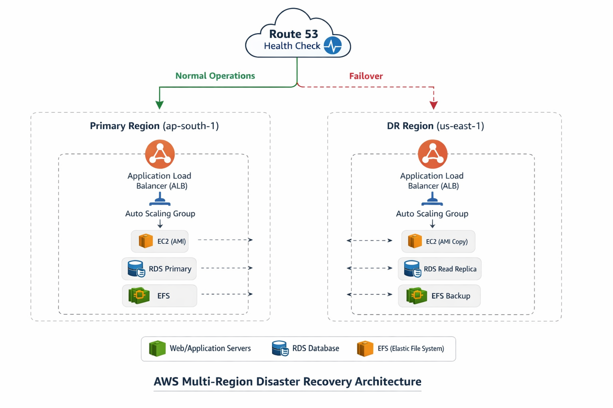

# 🚀 AWS Multi-Region Disaster Recovery Architecture (Production-Grade)

## 📌 Overview
This project demonstrates a **fully automated, production-ready Multi-Region Disaster Recovery (DR) architecture on AWS**, designed to achieve **high availability, fault tolerance, and regional resilience** for a web application.

The solution uses **AWS-native services** such as **EC2, Application Load Balancer (ALB), Auto Scaling, Route 53, RDS Read Replica, and EFS backups** to ensure **automatic failover with minimal downtime and data loss**.

This project reflects **real-world DevOps and Cloud Engineering practices** used in enterprise environments.

---

## 🏗️ Architecture Diagram



---

### 🔧 Architecture Components

**Primary Region (ap-south-1)**
- Application Load Balancer (ALB)
- Auto Scaling Group (EC2 instances from AMI)
- Amazon RDS (Primary)
- Amazon EFS (Shared storage)

**Disaster Recovery Region (us-east-1)**
- Application Load Balancer (ALB)
- Auto Scaling Group (EC2 from copied AMI)
- Amazon RDS Read Replica
- Amazon EFS backup / replicated data

**Global Services**
- Amazon Route 53 (DNS Failover & Health Checks)
## 🔄 Disaster Recovery Flow

1. User traffic enters through **Amazon Route 53**
2. Route 53 routes traffic to **Primary ALB (ap-south-1)**
3. Health checks continuously monitor application health
4. On failure detection:
   - Route 53 redirects traffic to **DR ALB (us-east-1)**
   - Auto Scaling launches EC2 instances from copied AMI
   - RDS Read Replica is promoted to Primary
5. Application becomes available from DR region **without manual intervention**

## 📂 Implementation Details

Detailed, step-by-step implementation guides with screenshots and diagrams
are available in the [`/steps`](./steps) directory:

- EC2 & AMI creation
- ALB & Auto Scaling setup
- Route 53 DNS failover
- RDS cross-region replication & promotion
- EFS backup strategy

## 🎯 Key Objectives
- Build **highly available infrastructure** across multiple Availability Zones and Regions
- Implement **automatic DNS-based failover**
- Enable **stateless application recovery** using AMIs and Auto Scaling
- Protect **stateful data (RDS & EFS)** against regional failures
- Validate DR using **real failure simulations**

---

## 🛠️ AWS Services Used

| Category | Services |
|--------|----------|
| Compute | EC2, AMI, Auto Scaling |
| Networking | VPC, ALB, Route 53 |
| Storage | EBS Snapshots, EFS |
| Database | RDS (Primary + Cross-Region Read Replica) |
| Security | IAM, Security Groups |
| Monitoring | Route 53 Health Checks |

---

## 🌍 Regions Used
- **Primary Region:** ap-south-1  
- **Disaster Recovery Region:** us-east-1  

---

## 📁 Project Structure

```text
aws-multi-region-dr/
│
├── architecture/
│   └── dr-architecture.png
│
├── steps/
│   ├── ec2-setup.md
│   ├── alb-asg.md
│   ├── route53.md
│   └── rds-dr.md
│
├── screenshots/
│
└── README.md
```
## 🔄 Disaster Recovery Flow

- User traffic enters through **Route 53**
- Primary **Application Load Balancer (ALB)** serves traffic from **ap-south-1**
- Route 53 **continuously monitors application health**
- On failure:
  - Traffic is **automatically routed to the DR region**
  - Auto Scaling **launches EC2 instances from the copied AMI**
  - **RDS Read Replica is promoted** to primary database

✅ **No manual intervention required**

---

## 🧪 Failure Scenarios Tested

- Primary EC2 instance stopped
- Application (NGINX) service stopped
- Auto Scaling instance termination
- Route 53 failover validation
- RDS Read Replica promotion

➡ **Result:** Application remained accessible via the **DR region**
---

## 📊 RTO & RPO (Design Targets)

| Metric | Value |
|------|-------|
| RTO (Recovery Time Objective) | ~1–2 minutes |
| RPO (Recovery Point Objective) | Seconds (replication lag) |

---

## 💡 Why This Project Stands Out

- Real **production-style disaster recovery design**
- Hands-on **failure testing (not just theoretical concepts)**
- Clean and **modular documentation**
- Covers both **stateless (EC2) and stateful (RDS, EFS) components**
- Strong **interview-ready cloud project**

> This project simulates how **enterprise systems survive regional outages**.

---

## 🧠 Key Learnings

- Difference between **EC2 failover vs RDS failover**
- **DNS-based failover** using Route 53
- Importance of **AMI-based recovery**
- Cross-region replication **trade-offs**
- Auto Scaling behavior during **instance and service failures**

---

## 🚀 Future Enhancements

- Infrastructure automation using **Terraform**
- CI/CD pipeline integration
- **CloudWatch alarms** and notifications
- Centralized **AWS Backup policies**
- **S3 cross-region replication**

---

## 📣 About the Author

**Ritesh**  
Aspiring **Cloud & DevOps Engineer**  
Focused on building **resilient, scalable, and secure AWS architectures**

---

## ⭐ For Recruiters

This repository demonstrates:

- Cloud architecture design skills
- Disaster recovery planning and execution
- Operational and troubleshooting mindset
- Strong technical documentation practices

📌 Please explore the **`/steps` directory** for detailed, step-by-step implementation guides.


