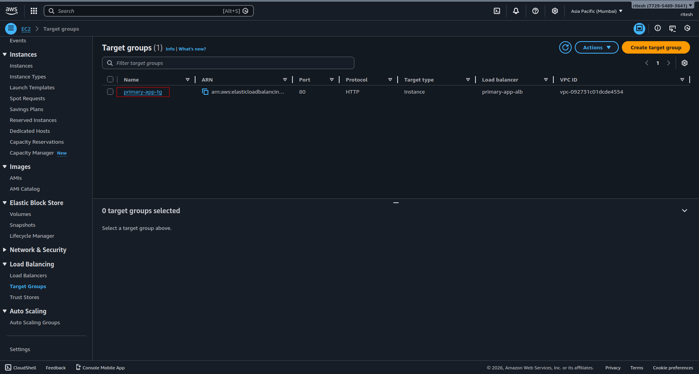
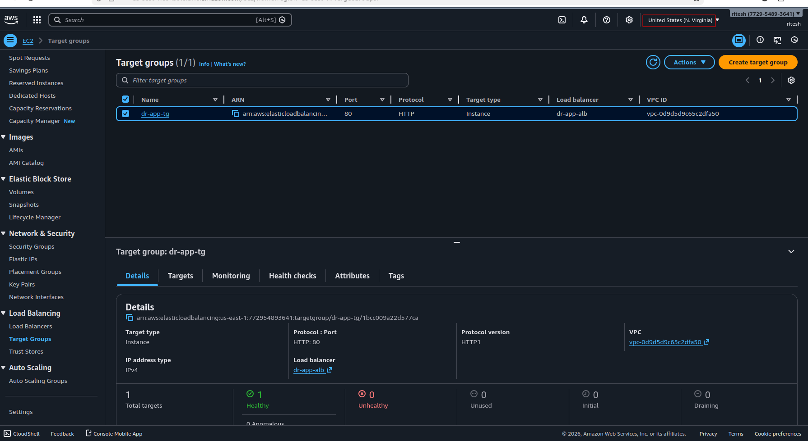
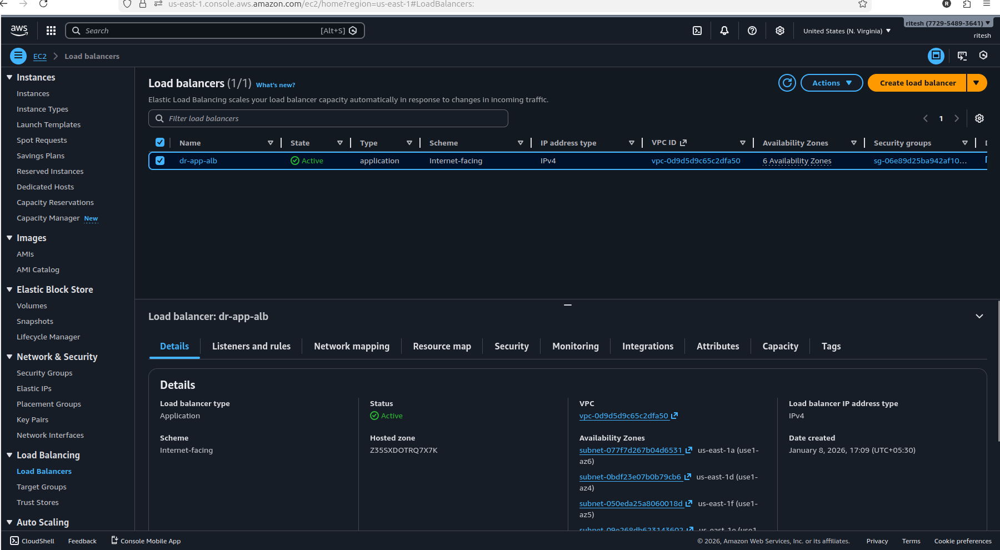
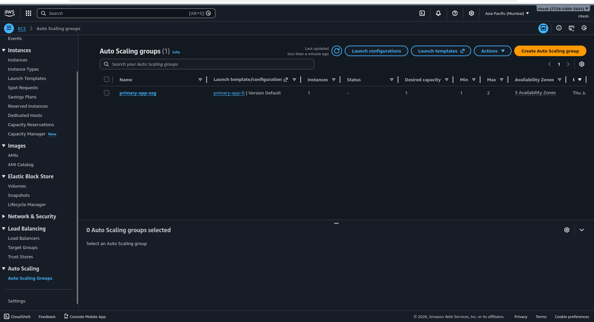
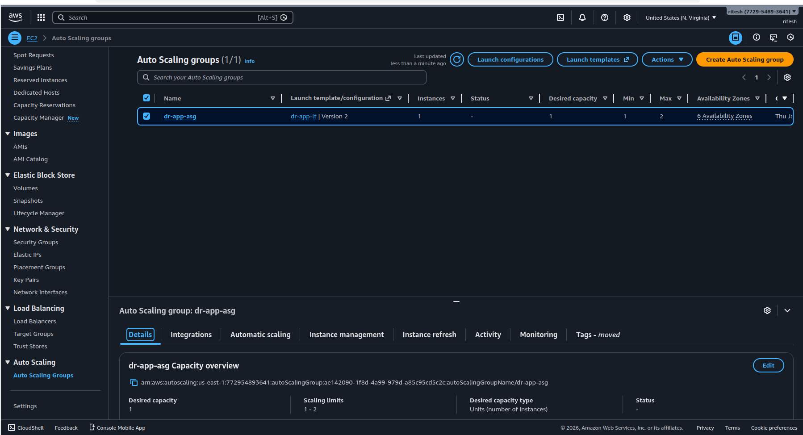

## 📄 Example: `steps/alb-asg.md`

# Step 2: ALB & Auto Scaling Setup

## Objective
Ensure high availability and self-healing EC2 infrastructure.

## Why This Step?
- ALB distributes traffic
- Auto Scaling replaces failed instances automatically

## Services Used
- ALB
- Target Group
- Auto Scaling Group
- Launch Template

## Implementation Steps

### 1️⃣ Create Target Group
- Type: Instance
- Protocol: HTTP
- Health check path: /

### 2️⃣ Create Application Load Balancer
- Internet-facing
- Select ALL AZs (Best Practice)
- Attach target group

### 3️⃣ Create Launch Template
- Use AMI from Step 1
- Select correct VPC Security Group

### 4️⃣ Create Auto Scaling Group
- Desired: 2
- Min: 1
- Max: 4
- Attach ALB

## Outcome
- EC2 instances auto-heal
- Application always available

