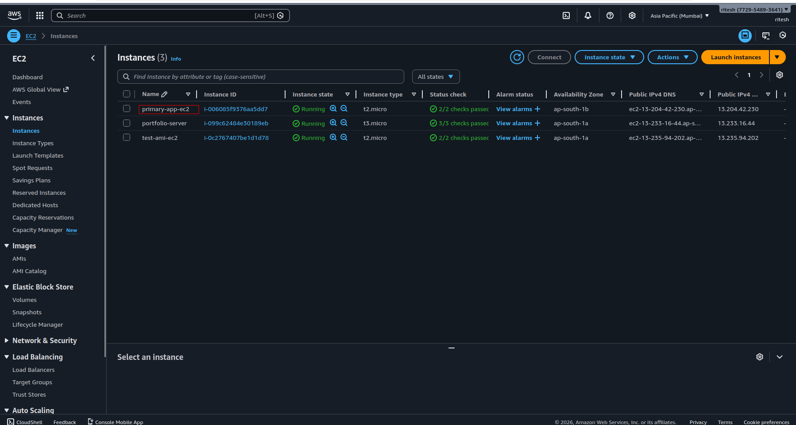
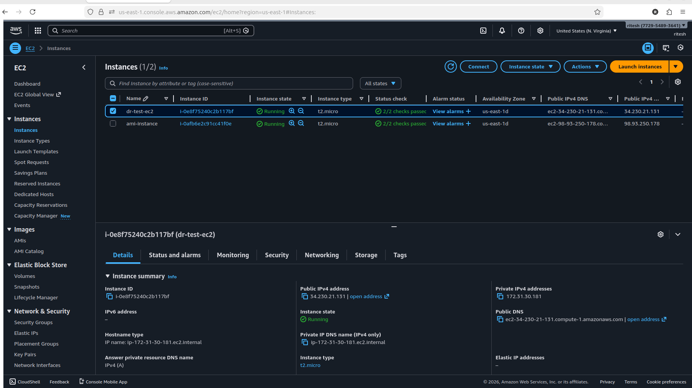
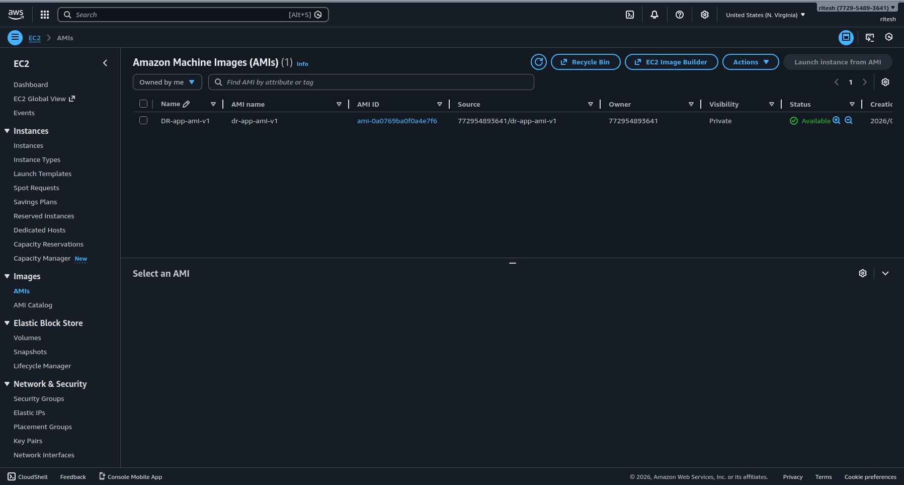
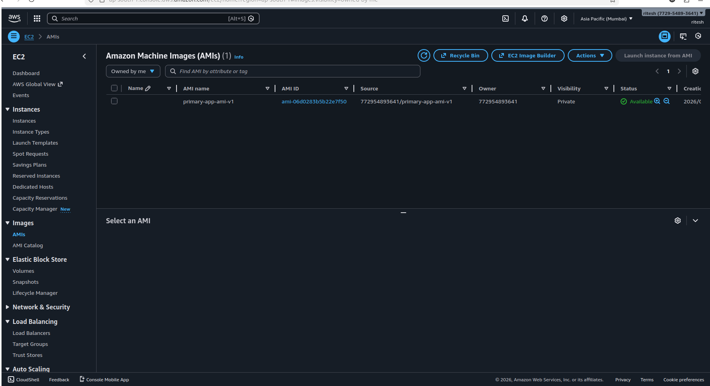

# Step 1: EC2 & AMI Setup (Primary Region)


In this step, we launch an EC2 instance in the primary region
(ap-south-1) and deploy an NGINX application.
## Objective
Launch an EC2 instance and prepare a reusable AMI for Auto Scaling and DR.

## Why This Step?
- EC2 hosts the application
- AMI ensures consistent server configuration
- Enables fast recovery in another region

## Services Used
- EC2
- AMI
- Security Groups

## Implementation Steps

### 1️⃣ Launch EC2
- Region: ap-south-1
- AMI: Amazon Linux 2
- Instance type: t2.micro
- Security Group:
  - SSH (22)
  - HTTP (80)
---


### 2️⃣ Install Application
```bash
sudo yum install nginx -y
sudo systemctl start nginx
```
### Verify Application
Open browser

``` 
http://<ec2-public-ip>
```
### Create AMI
- EC2--> Action --> Create Image
- Name: primary-app-ami




### OUTCOME
- Application is running 
- AMI created for auto scalling and DR region
