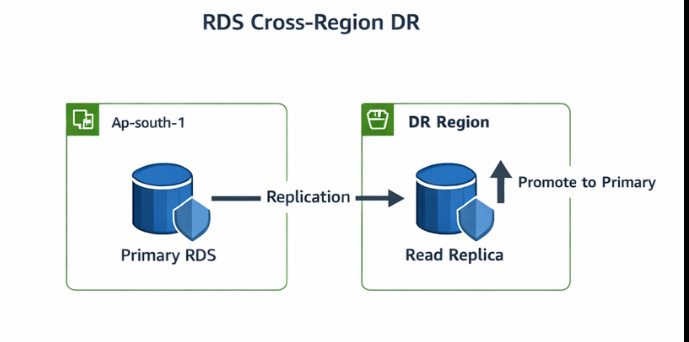
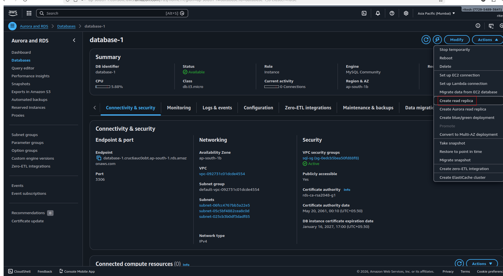
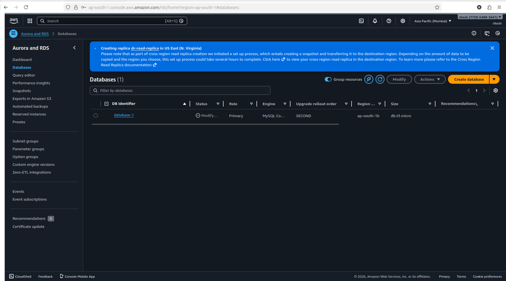

# Step 4: RDS Disaster Recovery

A cross-region read replica is maintained and promoted during
regional failure.
## Objective
Protect application data using cross-region replication.

## Why This Step?
- EC2 is stateless
- Database must survive region failure

## Services Used
- RDS
- Cross-Region Read Replica

## Implementation Steps

### 1️⃣ Create Primary RDS
- Region: ap-south-1
- Engine: MySQL
- Optional: Multi-AZ
- 

### 2️⃣ Create Read Replica
- Region: us-east-1
- Continuous replication
- 

### 3️⃣ Promote Replica (DR Test)
- RDS → Promote read replica

## Outcome
- Near-zero data loss
- Production-ready DR database

