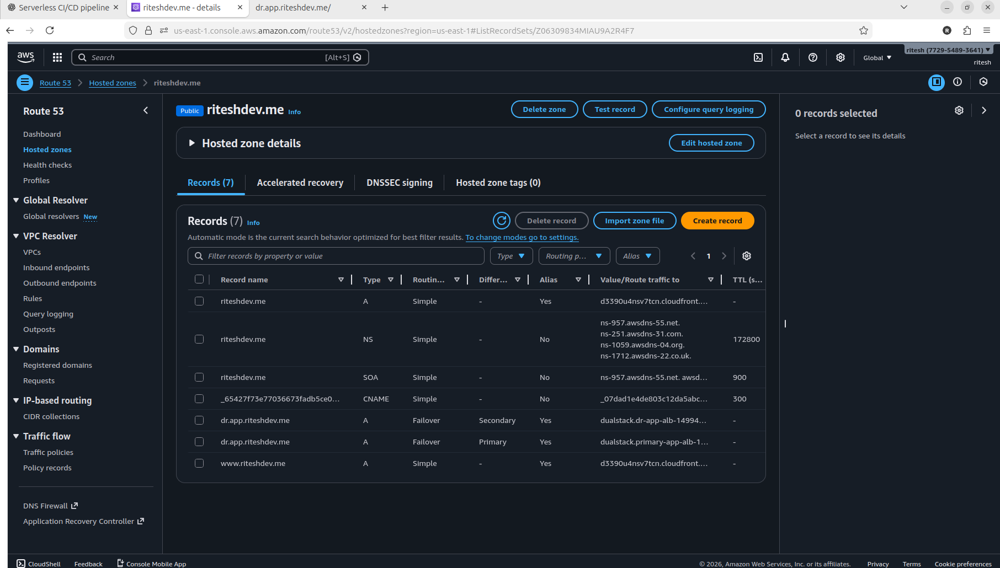

# Step 3: Route 53 Failover Routing

Route 53 continuously monitors the health of the primary ALB
and redirects traffic to the DR region during failure.
## Objective
Automatically route traffic to DR region during failure.

## Why This Step?
- DNS-based failover
- No manual intervention needed

## Services Used
- Route 53
- Health Checks
- ALB

## Implementation Steps

### 1️⃣ Create Hosted Zone
Domain:
riteshdev.me

### 2️⃣ Create Health Check
- Endpoint: Primary ALB
- Path: /
- Failure threshold: 3

### 3️⃣ Create DNS Records

#### Primary Record
- Routing: Failover (Primary)
- Alias → Primary ALB
- Evaluate target health: Yes

#### Secondary Record
- Routing: Failover (Secondary)
- Alias → DR ALB

## Outcome
- Traffic shifts automatically on failure

